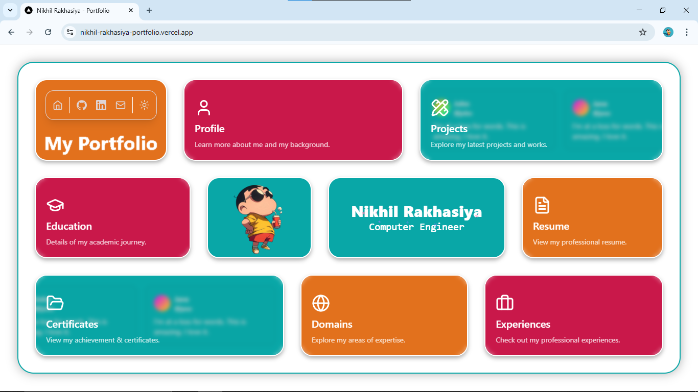

# 👨‍💻 Nikhil Rakhasiya – Developer Portfolio

Welcome to my personal portfolio website! This site showcases who I am, what I’ve done, and what I can do.

🔗 **Live Demo**: [nikhil-rakhasiya-portfolio.vercel.app](https://nikhil-rakhasiya-portfolio.vercel.app/)

---

## 📸 UI Preview

> Here’s a quick look at the homepage layout:



---

## 🚀 About Me

Hi, I'm **Nikhil Rakhasiya**, a passionate and enthusiastic **Computer Engineer**. I love building interactive web apps, exploring new technologies, and solving real-world problems through code.

---

## 🧰 Tech Stack

- **Frontend:** HTML5, CSS3, JavaScript, React.js
- **Design Tools:** Figma, Canva
- **Deployment:** Vercel

---

## 📁 Sections in My Portfolio

Each card on the homepage navigates to a specific section:

| Section      | Description                                  |
|--------------|----------------------------------------------|
| 🧑 Profile     | Overview about me and my interests           |
| 🛠️ Projects    | Showcase of all my featured work             |
| 🎓 Education   | My academic background                       |
| 🏆 Certificates| Achievements & certifications                |
| 📜 Resume      | Download or view my professional resume      |
| 🌍 Domains     | My areas of expertise                        |
| 💼 Experiences | Previous internships and work experience     |

---

## ✨ Features

- 🎨 Stylish, card-based responsive layout
- ☀️ Light/Dark mode support
- 🖱️ Smooth hover and transition effects
- 🔗 Social media and GitHub integration
- 📱 Fully mobile responsive

---

## 🛠️ Installation & Run Locally

```bash
git clone https://github.com/yourusername/nikhil-portfolio.git
cd nikhil-portfolio
npm install
npm start
